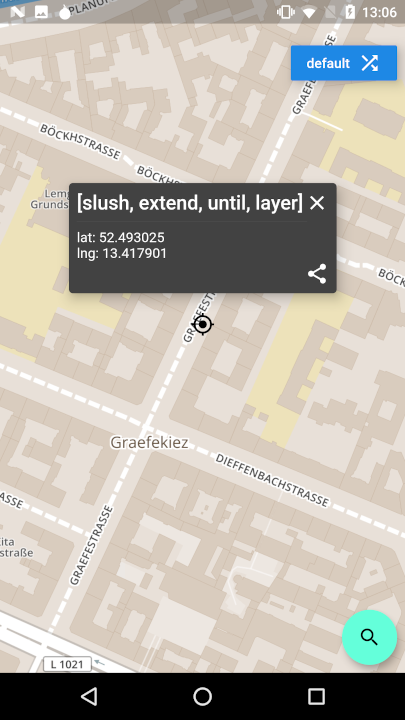
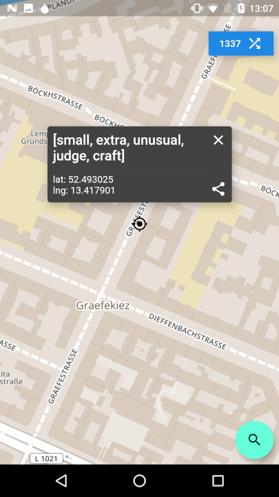
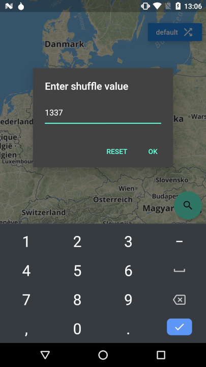
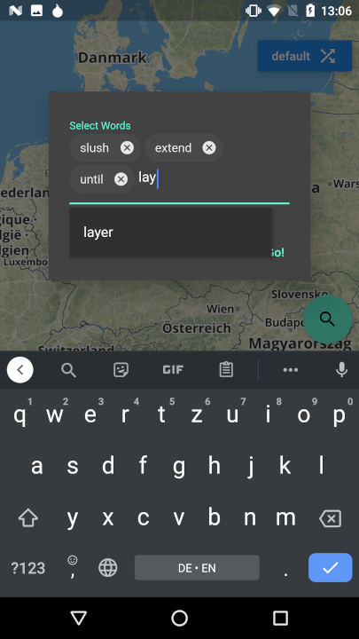

# Where 39

A simple mapping application that uses words to instead of latitude and longitudes.

Original: https://where39.com / [source](https://github.com/arcbtc/where39)

## Building

You can follow these instructions to build the app
and install it onto your device.

### Prerequisites

If you are new to Flutter, please first follow the [Flutter Setup](https://flutter.dev/setup/) guide.

### Building and installing the Flutter app

* `cd example`
* `flutter pub get`
* `flutter run --release`

The `flutter run --release` command both builds and installs the app.

## Screenshots

## Icon

Android launcher icons were generated using Android Asset Studio:
https://romannurik.github.io/AndroidAssetStudio/icons-launcher.html